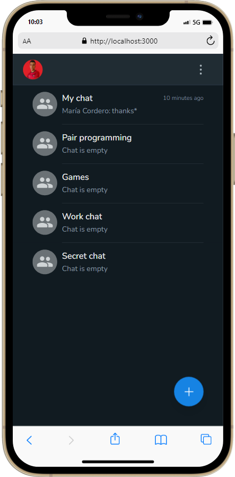
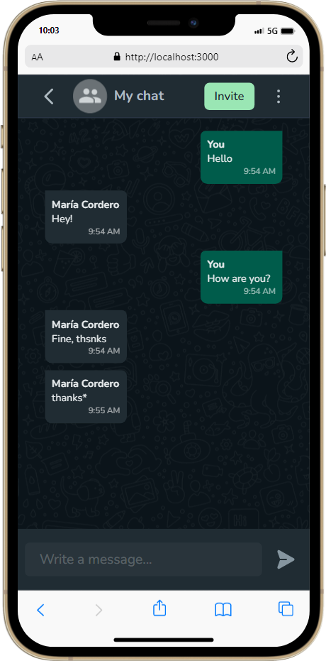
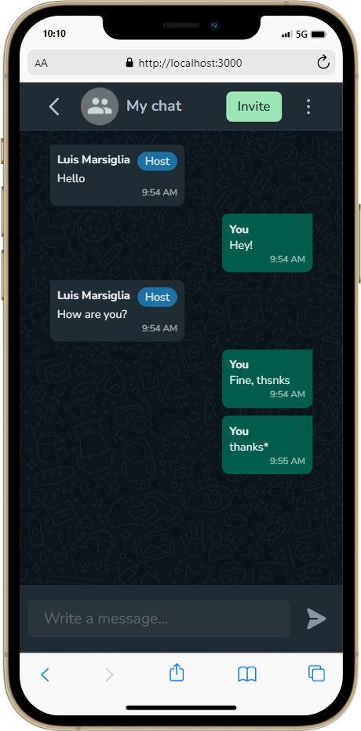
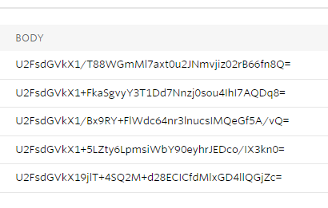

## Bubble Chat
Live and secure chat strongly inspired on WhatsApp. Powered by [Twilio Conversations API](https://www.twilio.com/messaging/conversations-api). <br />
Created to participate in a hackathon hosted by [midudev](https://www.github.com/midudev).

## 🚀 Preview
App preview before deadline and project review: <br />
<div style="display:flex; text-align:center; align-items:center; gap:1em;">
	
	
	
</div>

- [Demo](https://bubble-marsiglia.vercel.app)
> Screenshots provided by [webmobilefirst](https://www.webmobilefirst.com/en/).

## ✨ Features
- Login with GitHub
- Ability to create multiple chats
- Ability to delete chats
- Ability to leave a chat
- Invitation link with expiration of an hour
- Dynamic routes for chats
- 
	<div style="text-align:left; align-items:flex-start;">
 		<p>Encrypted messages</p>
  	
	</div>

## 👨‍💻 Hackathon Info
- The hackathon goal was build a live and secure text chat (*mobile-first* or *mobile-only*) using [Twilio Conversations API](https://www.twilio.com/messaging/conversations-api).
- Announced at **[2022/07/01](https://www.twitch.tv/videos/1519558242)**.
- Deadline: **2022/07/20**.

## 🛠️ Technologies
- [Twilio Conversations API](https://www.twilio.com/messaging/conversations-api)
- [TypeScript](https://github.com/microsoft/TypeScript)
- [NextJS](https://github.com/vercel/next.js/)
- [ChakraUI](https://github.com/chakra-ui/chakra-ui)
- [Zustand](https://github.com/pmndrs/zustand)
- [tRPC](https://github.com/trpc/trpc)
- [zod](https://github.com/colinhacks/zod)
- [Supabase](https://github.com/supabase/supabase)
- [Prisma](https://github.com/prisma/prisma)
- [next-auth](https://github.com/nextauthjs/next-auth)

## 🧰 Requirements
- [NodeJS](https://nodejs.org)
- [A Twilio account](https://www.twilio.com)
- [Twilio Token Service](https://github.com/marsidev/twilio-token-service)

## ✨ Getting Started

### 1. Create a [Twilio Token Service](https://github.com/marsidev/twilio-token-service).
This is a service to generate a [Twilio Access Token](https://www.twilio.com/docs/iam/access-tokens), using [Twilio Functions](https://www.twilio.com/docs/runtime/functions) (serverless functions). The token provides the required permissions. Created using [Twilio official guide](https://www.twilio.com/blog/generate-access-token-twilio-chat-video-voice-using-twilio-functions).

### 2. Create a [Supabase](https://app.supabase.com/) project.

### 3. [Create](https://docs.github.com/es/developers/apps/building-oauth-apps/creating-an-oauth-app) a GitHub App.

### 4. Clone this project using one of these ways:
- [Forking](https://github.com/marsidev/bubble/fork) the repository
- Cloning the repository locally
  ```bash
  git clone https://github.com/marsidev/bubble
  cd bubble
  ```
 
### 5. Set environment variables
Create an `.env` file in the root of your project and add the following values:
```bash
TWILIO_TOKEN_SERVICE_URL=
DATABASE_URL=
NEXTAUTH_SECRET=
NEXTAUTH_URL=http://localhost:3000
GITHUB_ID=
GITHUB_SECRET=
CRYPTO_SECRET=
```
> Fill the `TWILIO_TOKEN_SERVICE_URL` with the token service URL generated in step 1.

> Fill the `DATABASE_URL` with the URL of your Supabase Database, under `Settings > Database > Connection string > Nodejs`.

> Fill the `NEXTAUTH_SECRET` with a secret string. This is used to sign the JWT tokens.

> Fill the `GITHUB_ID` and `GITHUB_SECRET` with the GitHub App credentials generated in step 3.

> Fill the `CRYPTO_SECRET` with a secret string. This is used to encrypt/decrypt chat messages and invitation links.

### 6. Install dependencies
```bash
pnpm install
```

### 7. Run the project
```bash
npx prisma migrate dev
npx prisma generate
pnpm dev
```

Open [http://localhost:3000](http://localhost:3000) with your browser to see the result.

## ℹ️ Credits
<a target="_blank" href="https://icons8.com/icon/EEnPFPeiIW8t/whatsapp">Logo icon</a> by <a target="_blank" href="https://icons8.com">Icons8</a>

## 🤝 Contributing
Contributions, issues and feature requests are welcome!
Feel free to check [issues page](https://github.com/marsidev/bubble/issues).
